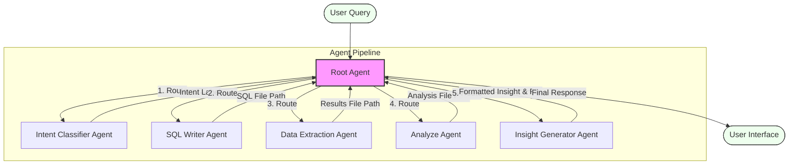

# Query-to-Insight Agent Workflow

This document illustrates the sequential workflow of the multi-agent system. The system processes a user's natural language business question and transforms it into actionable insights through a chain of specialized agents.

## Workflow Diagram

## Agent Roles & Data Flow

1.  **Intent Classifier Agent**:
    *   **Input**: User's natural language question (e.g., "Most selling course?").
    *   **Output**: A specific intent label (e.g., `COURSE_SALES`, `REVENUE_ANALYSIS`).
    *   **Role**: Determines *what* kind of analysis is needed without touching the database.

2.  **SQL Writer Agent**:
    *   **Input**: User question + Intent Label.
    *   **Output**: A text file containing a valid SQLite query (`.txt`).
    *   **Role**: Translates the logical intent into a specific database query based on the known schema.

3.  **Data Extraction Agent**:
    *   **Input**: Path to the SQL query file.
    *   **Output**: A tab-separated text file containing the raw query results.
    *   **Role**: Executes the SQL against `datatechcon.db`. Is the only agent with database access.

4.  **Analyze Agent**:
    *   **Input**: Path to the raw results file + Intent Label.
    *   **Output**: A tab-separated text file containing processed analysis (e.g., aggregations, rankings).
    *   **Role**: Performs Python-based data manipulation (Pandas) to derive meaning from raw rows.

5.  **Insight Generator Agent**:
    *   **Input**: Path to the analysis file.
    *   **Output**: A strictly formatted two-line paragraph summary.
    *   **Role**: Translates technical statistics into human-readable business insights.
