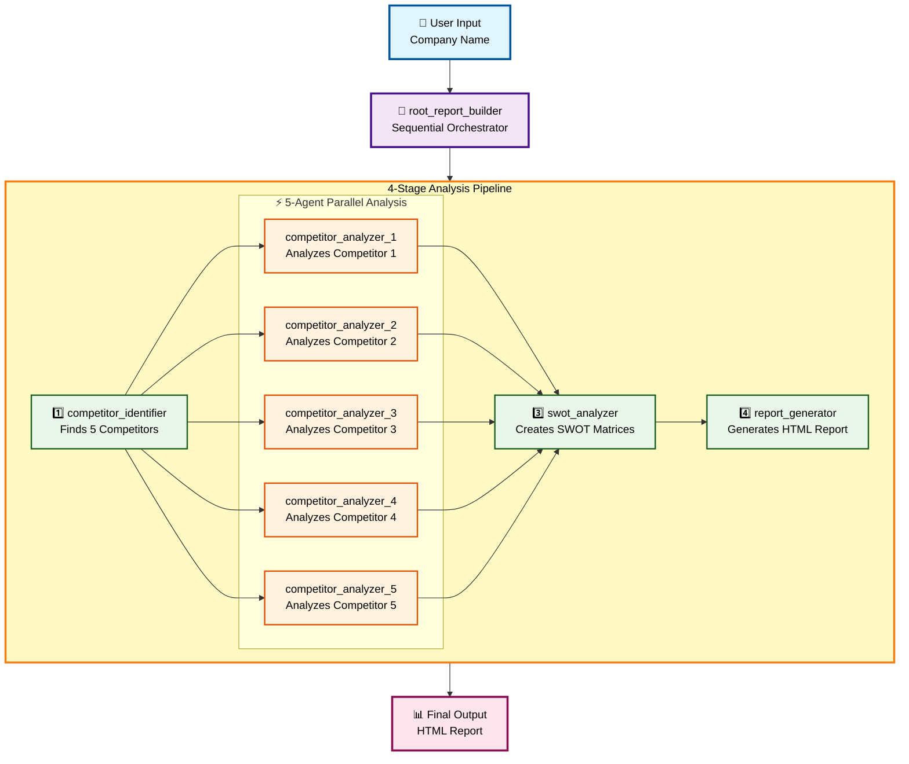

# Competitive Market Analysis System - Agent Flow Diagram

## Complete System Architecture



## Data Flow

### Stage 1: Competitor Identification
```
User Input: "Apple"
    ↓
competitor_identifier
    ↓
Output: ["Samsung", "Microsoft", "Google", "Amazon", "Meta"]
State Key: competitor_identifier_output
```

### Stage 2: Parallel Competitor Analysis
```
Input: Each competitor name
    ↓
5 Parallel Agents (Simultaneous Analysis)
    ├→ competitor_analyzer_1 analyzes Samsung
    ├→ competitor_analyzer_2 analyzes Microsoft
    ├→ competitor_analyzer_3 analyzes Google
    ├→ competitor_analyzer_4 analyzes Amazon
    └→ competitor_analyzer_5 analyzes Meta
    ↓
Output: 5 Detailed competitor profiles
State Key: competitor_analyzer_output
```

### Stage 3: SWOT Synthesis
```
Input: All 5 competitor analyses
    ↓
swot_analyzer
    ↓
Output: 
  - Individual SWOT matrices
  - Comparative analysis
  - Market opportunities
  - Threat assessment
State Key: swot_analyzer_output
```

### Stage 4: Report Generation
```
Input: SWOT analysis + all competitive data
    ↓
report_generator
    ↓
Output: Professional HTML Report
File: output/[timestamp]_competitive_analysis_report.html
State Key: report_generator_output
```

## Key Features

### 🎯 Sequential Orchestration
- Root agent manages the 4-stage pipeline
- Each agent runs in sequence with data passing

### ⚡ Parallel Processing
- 5 competitor analysis agents run simultaneously
- Reduces total execution time by ~80%
- All results consolidated for SWOT analysis

### 📊 Data Synthesis
- Competitor data flows through state keys
- Each agent processes and enhances the data
- Final report integrates all intelligence

### 🔄 Workflow
```
Identify → Analyze → Synthesize → Report
```

## Agent Specifications

| Agent | Model | Role | Input | Output |
|-------|-------|------|-------|--------|
| competitor_identifier | Gemini 2.5 Flash | Finds 5 competitors | Company name | List of competitors |
| competitor_analyzer | Gemini 2.5 Flash | Deep analysis | Competitor name | Detailed profile |
| swot_analyzer | Gemini 2.5 Flash | Strategic analysis | 5 profiles | SWOT matrices |
| report_generator | Gemini 2.5 Flash | Report creation | SWOT data | HTML report |

## State Flow

```
State["competitor_identifier_output"]
    ↓ (passes to all 5 parallel agents)
State["competitor_analyzer_output"]
    ↓ (aggregated)
State["swot_analyzer_output"]
    ↓
State["report_generator_output"]
    ↓
Final HTML File
```

## Performance Characteristics

- **Sequential Agents:** competitor_identifier, swot_analyzer, report_generator
- **Parallel Agents:** 5x competitor_analyzer (simultaneous)
- **Total Processing:** ~60-90 seconds depending on analysis depth
- **Output:** Single HTML file (~2-5 MB)

---

## Usage in VS Code

1. Install **"Mermaid Preview"** extension
2. Open this file in VS Code
3. Use `Ctrl+Shift+P` → "Mermaid Preview: Open Preview to the Side"
4. The diagram will render beautifully with interactive elements
